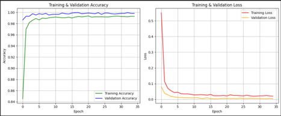

# Klasifikasi-Alat-Musik-Tradisional-Pulau-Jawa

## Domain Proyek
Dalam konteks proyek ini kita mengklasifikasikan jenis alat musikdari pulau jawa, Dimana klasifikasi ini diciptakan menggunakan algorithma Convoutional Neural Network.
Project klasifikasi alat musik ini yaitu untuk mengenalkan alat musik dengan cara mengcsan atau meng import gambar alat musik.

## Business Understanding
Aplikasi ini digunakan untuk memahami alat musik dari pulau jawa. Untuk menarik minat terhadap alat musik tradisional yang dapat dimanfaatkan oleh masyarakat umum, pelajar, serta wisatawan sebagai sarana pengenalan budaya secara modern dan interaktif.

## Data Understanding
Data yang digunakan dalam penelitian ini berupa citra digital dari alat musik tradisional yang berasal dari Pulau Jawa. Dataset terdiri dari beberapa kelas, antara lain: 
1. Dogdog Lojor 
2. Tehyan 
3. Angklung 
4. Calung 
5. Celempung
6. Gong 
7. Karinding 
8. Kecapi 
9. Rebab 
10. Suling 
11. Tarawangsa 
12. Bonang 
13. Demung 
14. Siter 
15. Kluncing 
16. Saronen 
17. Kendang

Gambar untuk tiap kelas berformat JPG atau PNG dan diperoleh dari berbagai sumber seperti Google Images, dataset publik, dan museum.

## Data Preparation
Dataset dibagi menjadi tiga bagian, yaitu 80% untuk data pelatihan, 10% untuk validasi, dan 10% untuk pengujian. Pembagian ini dilakukan dengan memindahkan gambar ke dalam folder terpisah sesuai dengan bagiannya (train, val, dan test).

## Modelling
Model klasifikasi dibangun dengan menggunakan arsitektur MobileNetV2, yang merupakan salah satu arsitektur CNN Deep Learning yang terkenal karena performa tinggi dalam klasifikasi citra.

## Evaluation 
Evaluasi dilakukan dengan menggunakan metrik akurasi, precision, recall, dan confusion 

